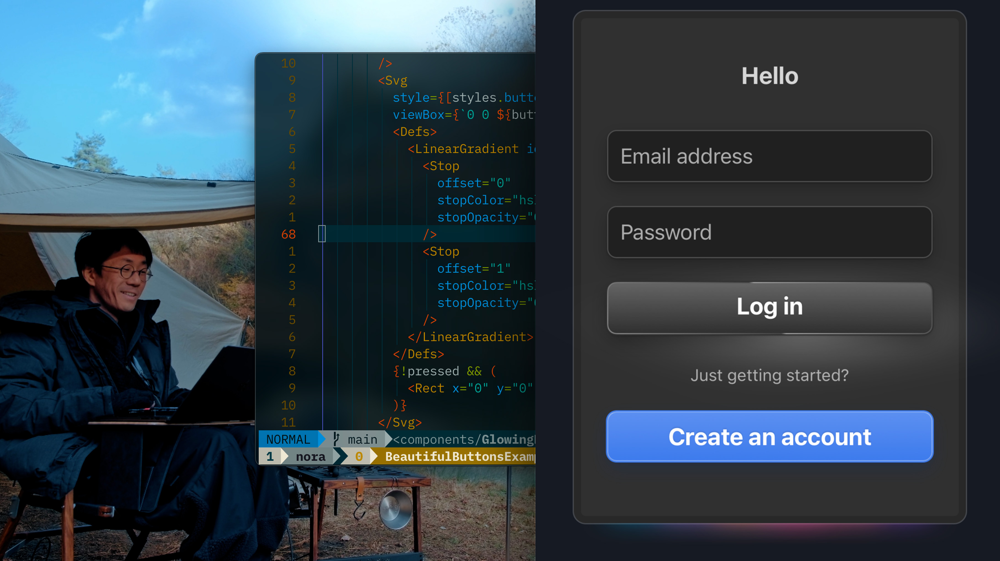

## Beautiful Glowing Components using Box Shadows in React Native 0.76+

Watch tutorial:

[](https://youtu.be/Ecq2kcubTnY)

## Ingredients

- React Native - 0.76+
- Expo - Framework for React Native
- [react-native-svg](https://github.com/software-mansion/react-native-svg) - SVG library
- [moti](https://moti.fyi/) - Animation library

### Looking for a Markdown note-taking app?

Check out my app called [Inkdrop](https://www.inkdrop.app/)

[](https://www.inkdrop.app/)


## Get started

1. Install dependencies

   ```bash
   npm install
   ```

2. Start the app

   ```bash
    npx expo start
   ```

In the output, you'll find options to open the app in a

- [development build](https://docs.expo.dev/develop/development-builds/introduction/)
- [Android emulator](https://docs.expo.dev/workflow/android-studio-emulator/)
- [iOS simulator](https://docs.expo.dev/workflow/ios-simulator/)
- [Expo Go](https://expo.dev/go), a limited sandbox for trying out app development with Expo

You can start developing by editing the files inside the **app** directory. This project uses [file-based routing](https://docs.expo.dev/router/introduction).

